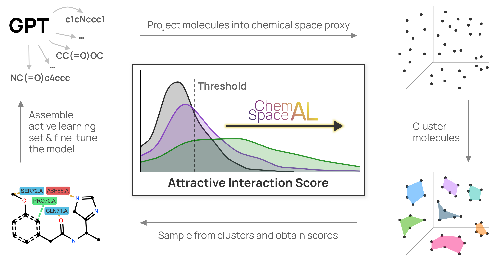

# ChemSpaceAL: An Efficient Active Learning Methodology Applied to Protein- Specific Molecular Generation

[](https://www.python.org/downloads/)
[](https://mypy-lang.org/)
[](https://github.com/psf/black)
[](https://codecov.io/gh/batistagroup/ChemSpaceAL)
[](https://github.com/batistagroup/ChemSpaceAL/blob/main/LICENSE)
[](https://pypi.org/project/ChemSpaceAL/)
<a target="_blank" href="https://colab.research.google.com/github/batistagroup/ChemSpaceAL/blob/main/ChemSpaceAL.ipynb">
  
</a>



## Abstract

The incredible capabilities of generative artificial intelligence models have inevitably led to their application in the domain of drug discovery. Within this domain, the vastness of chemical space motivates the development of more efficient methods for identifying regions with molecules that exhibit desired characteristics. In this work, we present a computationally efficient active learning methodology that requires evaluation of only a subset of the generated data in the constructed sample space to successfully align a generative model with respect to a specified objective. We demonstrate the applicability of this methodology to targeted molecular generation by fine-tuning a GPT-based molecular generator toward a protein with FDA-approved small-molecule inhibitors, c-Abl kinase. Remarkably, the model learns to generate molecules similar to the inhibitors without prior knowledge of their existence, and even reproduces two of them exactly. We also show that the methodology is effective for a protein without any commercially available small-molecule inhibitors, the HNH domain of the CRISPR-associated protein 9 (Cas9) enzyme. We believe that the inherent generality of this method ensures that it will remain applicable as the exciting field of in silico molecular generation evolves. To facilitate implementation and reproducibility, we have made all of our software available through the open-source ChemSpaceAL Python package.

## Preprint

Associated preprint can be found on [arXiv](https://arxiv.org/abs/2309.05853). Note, a second version of the preprint has been posted on Dec 4, 2023.

## Installation

in order to install the [ChemSpaceAL package](https://pypi.org/project/ChemSpaceAL/), simply run:

```pip install ChemSpaceAL```

You could also open [ChemSpaceAL.ipynb in Google Colab](https://colab.research.google.com/github/batistagroup/ChemSpaceAL/blob/main/ChemSpaceAL.ipynb) to see an example of how to use a package.

## Contact

Please feel free to reach out to us through either of the following emails if you have any questions or need any additional files:

- <gregory.kyro@yale.edu>
- <anton.morgunov@yale.edu>
- <rafi.brent@yale.edu>
